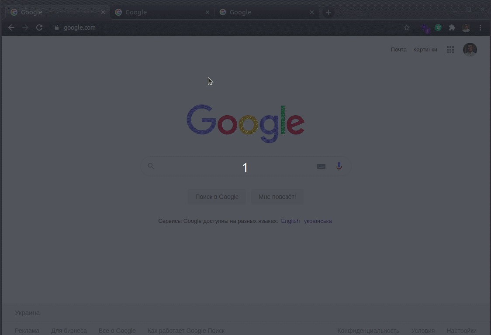

<h1 align="center"> Count Online Users </h1> <br>
<br/>
<p align="center">
  Count Online Users - tracks whether a user is online or not(has opened webpage in browser), showing a green button "Online" at the user card and changes the users counter at the subheader. Grey button with status "Online" if the user has been on site less than a minute ago. Built with RoR and React framework, deployed to Heroku.

  
</p>

## Table of Contents

- [Introduction](#introduction)
- [Features](#features)
- [Getting started](#getting-started)
- [Feedback](#feedback)

<!-- END doctoc generated TOC please keep comment here to allow auto update -->

## Introduction

This project only shows the current online user on the home page. This is useful for creating presence features like showing a green dot next to a user name if they're online.
To do that, it create each user automatically by unique ip address and type of device. To tracks users used **Rails Action Cable** and **WebSocket** technology. For fronted - used **React**.

How it works with Action Cable:


## Features

Main tasks:

* Using any of web application development technologies, create a service that counts users which opened current page of website
* Display counter on the same page
* Service should log errors
* Tests are welcome

Deployed to Heroku and available [online](https://count-online-users.herokuapp.com/). Unfortunately, the Action Cable does not work on heroku yet, so you cannot see the new user in real time, only after force update the page.

## Getting started

##### Prerequisites

The setups steps expect following tools installed on the system.

- Github
- Ruby [2.6.3](https://www.ruby-lang.org/en/news/2019/04/17/ruby-2-6-3-released/)
- Rails [5.2.4.4](https://weblog.rubyonrails.org/2020/5/18/Rails-5-2-4-3-and-6-0-3-1-have-been-released/)
- PostgreSQL >= 9.3

##### 1. Check out the repository

```bash
git clone https://github.com/Synkevych/ProjID-HR014.git
```

##### 2. Create database.yml file

By default this repo create database `count_online_users_development` but you can also copy the sample database.yml file and edit the database configuration as required.

```bash
cp config/database.yml.sample config/database.yml
```

##### 3. Create and setup the database

Run the following commands to create and setup the database.

```ruby
rails db:create
rails db:setup
rails db:migrate
rails db:seed # create 3 default user on database
```

##### 4. Start the Rails server

You can start the rails server using the command given below.

```ruby
bundle install
rails s
```

And now you can visit the site with the URL http://localhost:3000

##### 5. Deployment to Heroku instructions

`heroku login` - login to your profile  
`heroku create count-online-users` - create new heroku app with specific name  
`git push heroku master` - push you project to Heroku server  
`heroku run rake db:migrate` - run migration on Heroku server  
`heroku pg:reset` - drop database on Heroku server  
`heroku open` - open and test your website  

##### 6. Other useful command

`rails new count_online_users --webpack=react --database=postgresql -T` - create a new app with React and PostgreSQL  
`rails g model User name ip_address device`  
`rails db:setup db:create db:migrate`  
`rails g serializer User name ip_address device, emoji, last_seen_at, visits, online`  
`rails g channel Activity`  
`yarn add react-router-dom`  
`yarn add axios`  
`yarn add styled-components`  
`git add -A && git commit -m "fix: message"`  
``

## Feedback

Feel free to send us feedback on [Twitter](https://twitter.com/synkevych) or [file an issue](https://github.com/Synkevych/realtime_user_tracking/issues/new). Feature requests are always welcome.
